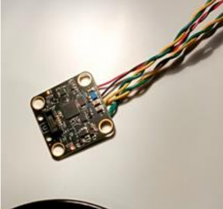

中文简体 | ...

# NI-Pigeon-Calibration

  

本篇文档是一份用于 **Next-Innovation** 电控组开发过程中标定Pigeon-IMU参数的指南。

本篇指南包含以下内容:

- 影响Pigeon-IMU零飘的主要因素。
- 对Pigeon-IMU进行温度标定的步骤。

## 目录

- [NI-Pigeon-Calibration](#NI-Pigeon-Calibration)
  - [影响Pigeon-IMU零飘或测算精准度的因素](#影响Pigeon-IMU零飘或测算精准度的因素)
  - [Pigeon-IMU的温度标定](#Pigeon-IMU的温度标定)

## 影响Pigeon-IMU零飘或测算精准度的因素

- 传感器安装位置是否位于COR(center of rotation: 旋转中心): 
   1. 把机器人抵在一个固定的平面上(比如一面墙)。
   2. 将Yaw轴数据归0，并初始化陀螺仪Z轴。
   3. 将机器人按照0转向(第2步结束后机器人的朝向)，以最大速度直行约30秒。
   4. 将机器人按照相反的方向，以最大速度直行约30秒或重新抵住平面。
   5. 读取机器人抵在平面时Yaw轴的读数和陀螺仪Z轴的读数。
   6. 如果Yaw轴数据不正确，陀螺仪Z轴数据正确，则Pigeon放置位置不处于COR，请校准位置。
- 避免IMU周围存在磁性/铁磁性材料。
- 机器人运行过程中的剧烈振动会影响到Pigeon的测算精度，可以使用橡胶塔或者橡胶索环来缓震Pigeon。
- 温度变化会极大程度上影响陀螺仪的零飘值，同时也在一定程度上会对加速计和地磁计的测量结果造成影响。最好且唯一的解决方法是为Pigeon重新进行温度标定，以调整温度补偿算法的参数。详情请看[Pigeon-IMU的温度标定](#Pigeon-IMU的温度标定)。

## Pigeon-IMU的温度标定

1. 使用 VSCode 打开同目录下的 "**Pigeon-Temperature-Calibration-Code**" 项目文件夹，并烧录代码。此处不再赘述配置项目文件夹的具体方法。

2. 打开 Driver Station 与 ShuffleBoard，观察 ShuffleBoard 中 Pigeon 的温度曲线，使其温度冷却至30℃以下。

3. 待 Pigeon 冷却到30℃以下后，通过 Driver Station 使机器人进入 "Test" 模式，然后使用日光灯照射 Pigeon 背面，之后程序将开始检测温度变化对 Pigeon 解算出的 Fused Heading 的值产生的影响(如图为 Pigeon 背面，通过日光灯照射，使 Pigeon 的表面温度依次经过30℃和60℃)。

   

4. 等待检测结束后，令Pigeon冷却至30℃以下。

5. 待Pigeon冷却到30℃以下后，通过Driver Station使机器人进入 "Autonomous" 模式，之后 Pigeon 将进入到温度标定模式。使用日光灯照射 Pigeon 背面。